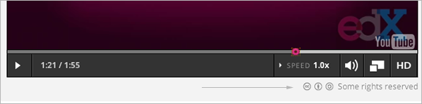

.. _Licensing a Course:

######################################################
Licensing a Course
######################################################

See:

* `Licensing Overview`_
* `License Options`_
* `Set Course Content Licensing`_
* `Set Video Licensing`_
* `Learners View of Licenses`_

.. _Licensing Overview:

*************************************
Licensing Overview
*************************************

You can specify licensing options for your course content as well as for each
video in your course.

By specifying the license, you communicate to learners whether and how they can
reuse your course content.

.. _License Options:

*************************************
License Options
*************************************

For your course content and for each video in your course, you can select one
of the following license options

* All rights reserved
* Creative Commons

.. _All Rights Reserved License:

====================================
All Rights Reserved License
====================================

The All Rights Reserved license indicates to learners that you own the
copyright for course content or videos. Learners cannot reuse or republish
course content or videos that have All Rights Reserved licenses."

.. _Creative Commons License:

====================================
Creative Commons License
====================================

The Creative Commons license indicates to learners that they can share or reuse
course content or videos, depending on the license options.

When you specify a Creative Commons license for your course or a video, you
specify one or more options.

.. list-table::
   :widths: 10 70
   :header-rows: 1

   * - License Option
     - Description
   * - **Attribution**
     - This option allows others to copy, distribute, display, and perform your
       copyrighted work but only if they give credit the way you request. This
       option is enabled for all Creative Commons licenses. You cannot clear
       this option.
   * - **Noncommercial**
     - This option allows others to distribute, display, and perform your work
       -- and derivative works based upon it -- but for non-commercial purposes
       only.
   * - **No Derivatives**
     - This option allows others to distribute, display, and perform only
       verbatim copies of your work, not derivative works based upon it.
   * - **Share Alike**
     - This option allows others to distribute derivative works only under a
       license identical to the license that governs your work.

See the `Creative Commons website`_ for more information.

.. _Creative Commons website: http://creativecommons.org/

.. _Set Course Content Licensing:

*************************************
Set Course Content Licensing
*************************************

You set the course content license when you :ref:`create a new course <Create a
New Course>`.

After you create a course, you can :ref:`change the course content license <Set
Content Licensing>` in the **Schedule and Details** page.

.. _Set Video Licensing:

*************************************
Set Video Licensing
*************************************

You set the license for each video in the course in the  :ref:`Video Advanced
Options`.

.. _Learners View of Licenses:

*************************************
Learners' View of Licenses
*************************************

While taking your course, learners can see the licenses you set for course
content and videos.

For all course content, learners see the license you set in COMPLETE WHEN LMS
FIXED.

For each video, learners see the license at the bottom right of the video
player:

Learners can click on the license to get more information.
